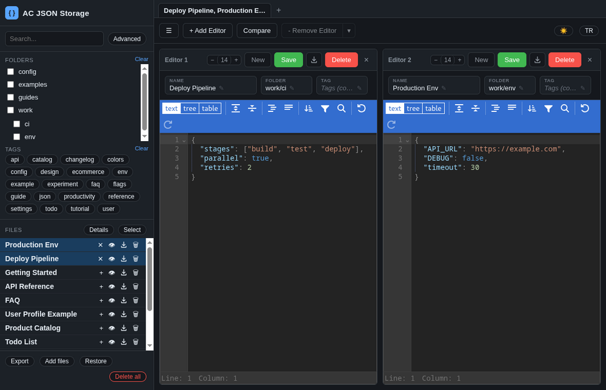
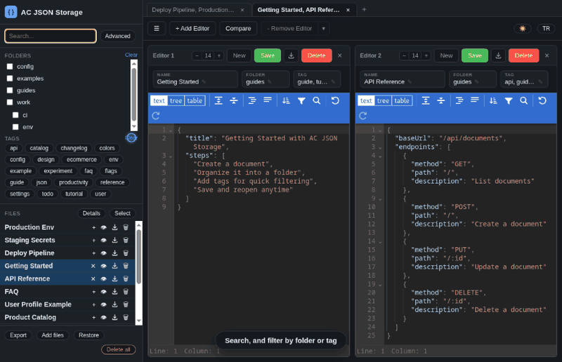
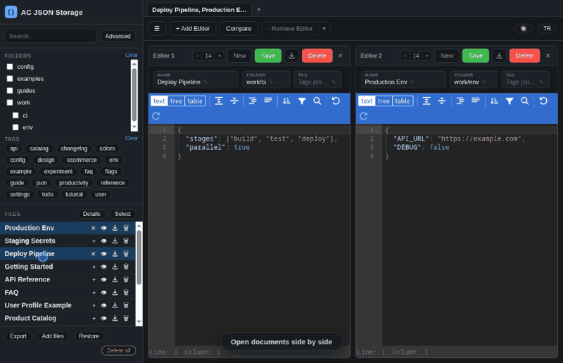
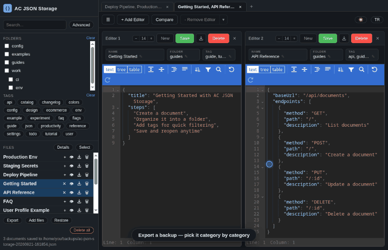
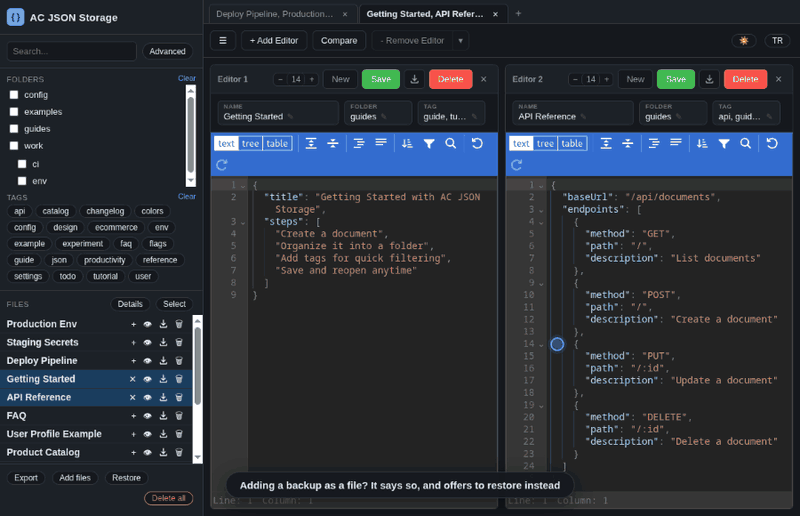
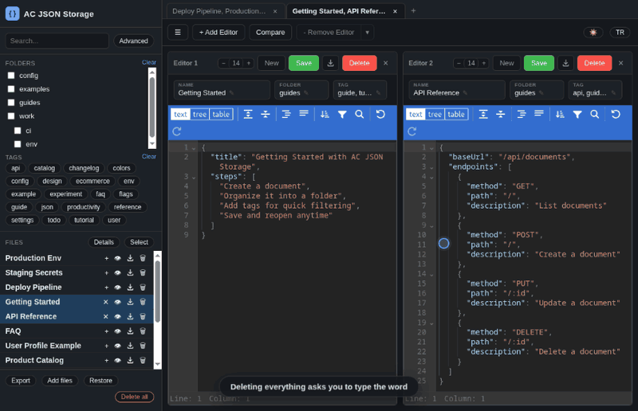

<h1 align="center">AC JSON Storage</h1>

<p align="center">
  A desktop home for the JSON you keep pasting into scratch files — folders,
  tags, search, editors side by side, and a real diff between them.<br>
  Everything stays in one local SQLite file. No account, no server, nothing
  leaves the machine.
</p>

<p align="center">
  
  
  
  
  
</p>

<p align="center">
  
</p>

## What you get

| | |
| --- | --- |
| **Side-by-side editors** | As many as fit, grouped into browser-style tabs, each with its own document, its own save state and its own font size. |
| **A real diff** | Compare any two editors structurally — including edits you have not saved yet. |
| **Folders and tags** | A flat `folder` string renders as a nested tree; search is scoped to name, folder or tag. |
| **Import and export** | Back up the store, restore it, add loose `.json` files, or save one document out — each with its own dialog that says what it is about to do. |
| **Two languages** | English and Turkish, switched at runtime. |
| **One file to ship** | An AppImage with no native modules to rebuild and no runtime to install. |

## A quick tour

<p align="center">
  
</p>

Font size per editor, the structural diff, the preview dialog, saving a single
document as a plain `.json`, and picking a backup apart category by category.
The whole 76-second tour is also a video: [`docs/tour.mp4`](docs/tour.mp4).

### Select several, open them in their own tab

<p align="center">
  
</p>

**Select** turns the list into checkboxes (Ctrl+click does the same without
it). **Open in new group** then builds a fresh tab with one editor per
document, which is how the desktop build replaces the second browser window
the web version used to open.

### Search and filter

<p align="center">
  
</p>

## Running and building

```bash
npm install
npm start                    # run the app
npm run pack                 # unpacked app tree -> dist/linux-unpacked/
npm run dist                 # AppImage          -> dist/
```

### Building in Docker
Nothing but Docker has to be installed on the host — no Node, no npm:

```bash
./build.sh           # AppImage          -> dist/
./build.sh pack      # unpacked app tree -> dist/linux-unpacked/ (fast feedback)
./build.sh install   # force a clean `npm ci` and stop
```

The container runs as the invoking user, so nothing in the source tree or in
`dist/` comes back root-owned. `node_modules` lives in the mounted tree and is
installed on the first run only; the npm cache, the downloaded Electron binary
and electron-builder's own cache go into the `ac-json-storage-cache` named
volume, which is what makes repeat builds quick.

This exists for reproducibility and CI. For everyday work `npm run dist` on
the host is the same build without the container overhead.

### Targets
AppImage is the only Linux target on purpose: one self-contained file, nothing
to install. Adding `"deb"` to `build.linux.target` works, but electron-builder
then demands a `homepage` and a maintainer in `package.json` before it will
run.

`npm run dist -- --win` / `--mac` target the other platforms, but each has to
be built on its own machine (Windows needs its own signing/NSIS setup, macOS
needs Xcode); nothing in the source is platform-specific.

There is no test suite and no build step. Verify changes by running the app,
or by hitting the API with `curl` once you know the port (see below).

### No native modules
The database goes through **`node:sqlite`**, part of the Node runtime Electron
bundles (Node 24 in Electron 43). There is nothing to compile against the
Electron ABI — no `better-sqlite3`, no `electron-rebuild`, no build toolchain
on the host. `npm install` is just a download, and `express` is the only
runtime dependency.

`node:sqlite` prints an `ExperimentalWarning` on stderr at startup. It is
expected and does not reach the UI.

## Where the data lives

One SQLite database, in Electron's per-user app-data directory:

| Platform | Path |
| --- | --- |
| Linux | `~/.config/ac-json-storage/db.sqlite` |
| Windows | `%APPDATA%\ac-json-storage\db.sqlite` |
| macOS | `~/Library/Application Support/ac-json-storage/db.sqlite` |

`DB_PATH` overrides it, which is also the easiest way to run a scratch copy:

```bash
DB_PATH=/tmp/scratch.sqlite npm start
```

Moving a database in is a file copy — take `db.sqlite` plus the `-wal`/`-shm`
files if present, with the app closed so nothing is left behind in the WAL.
Earlier builds of this app kept their database in
`~/.local/share/com.acacar.ac-json-storage/` on Linux (`%APPDATA%` and
`~/Library/Application Support` under the same name elsewhere); the schema is
unchanged, so those files can be dropped straight into the path above.

## Architecture

### An HTTP server inside the app, not IPC
On startup the main process opens the database, binds an Express server to
`127.0.0.1:0` (an OS-assigned port) serving both `/api/documents/*` and
`renderer/`, then points the `BrowserWindow` at that URL. The window loads the
app same-origin over plain HTTP, so `fetch('/api/...')` in the frontend just
works: no CORS, no injected base URL, no `ipcRenderer` bridge, no preload
script.

The alternative — `ipcMain.handle` plus a preload bridge — would mean
rewriting every call site in the frontend and inventing a second contract
alongside the HTTP one. The trade taken here is a loopback socket in exchange
for a frontend that is ordinary web code.

The window runs with `contextIsolation: true` and `nodeIntegration: false`. It
needs no privileged APIs, because everything privileged sits behind the API.

The port is random per run. To poke at the API from outside:
`ss -tlnp | grep ac-json-storage` while the app is running.

### Backend layout
| File | Holds |
| --- | --- |
| `main/main.js` | window, database path, app lifecycle, the native save dialog |
| `main/server.js` | Express app, static files, the one error handler |
| `main/routes/documents.js` | every endpoint, plus tag/transaction helpers |
| `main/db.js` | schema, demo seed data, the `user_version` marker |
| `main/time.js` | timestamp format and export filenames |

`node:sqlite`'s `DatabaseSync` is synchronous, so handlers read as
straight-line code. Multi-statement writes go through `transaction()` in
`routes/documents.js`, an explicit `BEGIN`/`COMMIT`/`ROLLBACK` wrapper — every
import runs inside one, so a malformed file leaves the database untouched.

Errors are thrown as `ApiError(status, message)` and turned into
`{"error": "..."}` by the single error handler in `server.js`. Anything that
is not an `ApiError` becomes a 500 and gets logged to the terminal.

### The save dialog
The renderer cannot write to disk, so `POST /api/documents/export` builds the
payload and hands the bytes to `saveFile()` in `main.js`, which raises
`dialog.showSaveDialog` and writes the chosen path. Dismissing the dialog
answers `{cancelled: true}` — a normal outcome, not an error. `showSaveDialog`
is async, so the event loop keeps serving requests while it is open.

### Assets ship inside the asar
`renderer/` is packed into the app's asar archive and served by
`express.static`, so the build is one artifact with no asset directory to
install beside it. Electron's `fs` patches make the archive readable as
ordinary files, which is why `express.static` needs no special handling.

### Window shell
`autoHideMenuBar` keeps the menu bar out of the way (Alt reveals it) while
still registering the standard edit/view/window accelerators. A single-instance
lock focuses the existing window instead of opening a second one, and any
navigation away from the loopback origin is handed to the system browser.

## Data model

Three tables (`main/db.js`):

- `documents` — `id`, `name`, `folder`, `content`, `created_at`, `updated_at`.
  `content` is the raw JSON **text**, stored as-is: never parsed or validated
  server-side, so an invalid document is still saveable and still yours.
- `tags` — every tag name that has ever existed.
- `document_tags` — the join table, `ON DELETE CASCADE` from `documents`.

Deleting documents leaves rows in `tags`, which stay invisible because every
tag listing joins through `document_tags`.

`folder` is a flat string like `work/api` with no server-side hierarchy
concept. `buildFolderTree()` in `app.js` splits it on `/` to render the nested
checkbox tree in the sidebar; renaming or moving a folder is really just
editing that string on every affected document.

### Demo data, seeded exactly once
A fresh database gets ten example documents across `guides`, `examples` and
`config`, so the first launch shows a populated sidebar instead of a blank
app. Seeding is keyed off SQLite's `user_version`, **not** off "is the table
empty?" — otherwise the demo documents would come back the next time the app
started after someone used **Delete all**. The pragma is stamped once and
never re-seeded; a database created before the marker existed gets stamped
without being re-seeded.

## API

| Method | Path | Notes |
| --- | --- | --- |
| GET | `/api/documents` | `search=`, `folders=`, `tags=`, `fields=name,folder,tag`; omits `content` |
| GET | `/api/documents/folders` | distinct non-empty folder strings |
| GET | `/api/documents/tags` | distinct tag names in use |
| GET | `/api/documents/:id` | includes `content` |
| POST | `/api/documents` | 201; `name` required |
| PUT | `/api/documents/:id` | response deliberately omits `created_at` |
| DELETE | `/api/documents/:id` | 204 |
| DELETE | `/api/documents` | deletes everything, answers `{deleted}` |
| GET | `/api/documents/export` | whole store as one JSON payload, no dialog |
| POST | `/api/documents/export` | whole store: native save dialog, then writes; `{path, count}` or `{cancelled: true}` |
| POST | `/api/documents/export-file` | one document: `{name, content}` -> save dialog; `{path}` or `{cancelled: true}` |
| POST | `/api/documents/import?mode=` | `merge` (default) or `replace` |
| POST | `/api/documents/import-files` | loose files: `{folder, files: [{name, content}]}` |

`folders=` and `tags=` are comma-separated lists matched with SQL `IN (...)`:
a document matches if it has **any** of the requested values (OR, not an AND
intersection). `search=` is scoped by `fields=`, defaulting to `name` alone
when omitted. The `tag` search field uses its own `EXISTS` subquery with
separate aliases so it does not collide with the exact-match tag JOIN when
both are active at once — keep that distinction before "simplifying" the
query.

Tags are trimmed, de-duplicated and dropped when empty on write; they come
back sorted by name.

The two import endpoints carry a 512 MB body limit against the 20 MB every
other endpoint uses, because a folder full of files in one request outgrows
what `express.json` allows by default.

## The frontend

### No build step, on purpose
`renderer/` is plain ESM served as static files — no bundler, no framework.
Third-party code is vendored the same way: `vanilla-jsoneditor`'s
`standalone.js` sits in `renderer/vendor/` and `app.js` imports it straight
from that URL. This only works for packages that ship a self-contained ESM
bundle, or a tree of plain relative-import ESM files with no bare specifiers —
check that before vendoring anything new, or it will 404 on import.

### Multi-pane editors, grouped into tabs
- `panes` is an array of pane objects (`createPane()` / `closePane()`), each
  holding its own editor instance, its own name/folder/tags fields and its own
  save/delete state. Pane numbering is not an identity: `renumberPanes()`
  recomputes the 1..N labels whenever a pane is added or closed, so they always
  read as a contiguous left-to-right sequence.
- `groups` is an array of `{ panes, container }` rendered as a browser-style
  tab strip. Only the active group's container is in the DOM flow; the rest
  carry `.hidden`. `panes` **aliases** the active group's array, which is why
  `closePane` splices in place instead of reassigning it, and why
  `setActiveGroup` is the only place that ever repoints it.
- A tab is named after the documents open in it, falling back to `Group N`
  while empty.
- Sidebar select mode (Ctrl+click, or the **Select** chip) plus **Open in new
  group** is how groups get created: one pane per selected document.
- `?open=<id>` is repeatable and fills the first group on load
  (`new URLSearchParams(location.search).getAll('open')`), so deep-linking
  survives even though nothing opens a second window any more.

### Editor font size
Each pane carries its own `− 14 +` control in its header. It changes the
**content** size only — the editor's own toolbar and the app around it keep
their size, the way an editor's font setting behaves rather than a browser
zoom. Window-wide zoom is a separate thing and lives in the View menu
(Ctrl +/−/0), which is why those keys are deliberately *not* bound to this.

- `Ctrl`/`Cmd` + wheel over an editor does the same thing, and a plain scroll
  is left alone.
- Clicking the number resets that pane to 14px. The range is 10–24px and the
  buttons disable at the ends.
- The last size chosen anywhere is remembered (`localStorage.editorFontSize`)
  and becomes the starting size for panes opened afterwards, so the preference
  sticks without being a global setting. The preview dialog, which has no
  control of its own, follows it too.

vanilla-jsoneditor sizes its content from two CSS variables — `--jse-font-size-mono`
(text mode and the code font, default 14px) and `--jse-font-size` (tree mode,
default 16px). `applyEditorFontSize()` sets both on the pane's own container,
which is what keeps the change scoped to that editor, and preserves the 8:7
ratio between them so tree mode stays proportional to text mode.

### Editable fields have a display/edit toggle
The name/folder/tags fields are not plain `<input>`s.
`createEditableField()` wraps a real input in a widget that shows plain text
plus a pencil icon and turns into an input when clicked. Any code that sets
`pane.nameInput.value` / `folderInput.value` / `tagsInput.value`
programmatically **must** call `pane.refreshFieldDisplays()` afterwards, or the
visible text goes stale while the underlying value is correct.

The two states have to occupy the same box, or the meta row grows on click and
shrinks again on blur. Two things guarantee that and both are easy to undo by
accident: `.pane-meta .field-input` cancels the padding `.pane-meta input`
(written for the preview dialog's plain inputs) would otherwise apply, and
`showEdit`/`showDisplay` hide the whole `.field-value-row` rather than the text
and pencil inside it — a hidden-but-present flex item still contributes its
`gap`.

### Import and export
**Export** opens a dialog listing every document grouped by category (its
folder), and writes the ticked ones — content, folder, tags and both
timestamps — to one backup file through a native save dialog.

- Ticking a category takes everything filed under it, sub-categories included:
  `work` covers `work/api` and `work/api/v2`. Category checkboxes go
  indeterminate when only part of their subtree is picked.
- Each category is five rows tall and scrolls on its own, so a folder with a
  hundred documents cannot push the rest off the list; the list as a whole
  scrolls too, and category headers stay stuck to the top while their rows move.
- The search box filters on document and folder name. **Everything the search
  and the ticks do is scoped to what is visible** — "select all" while
  filtering ticks only the matches.
- Everything is ticked when the dialog opens, so backing up the lot stays one
  click. That makes the footer's second job load-bearing: a search followed by
  "select all" keeps whatever the search hid, so whenever a search hides ticked
  documents the footer says how many are off screen. The Export button always
  carries the number it is about to write.
- Dismissing the native save dialog leaves the export dialog open with its
  selection intact — cancelling where to put the file is not a decision to
  abandon what to put in it.

`POST /api/documents/export` takes an optional `{ids}` body for this; with no
body it still writes the whole store, which is what `curl` and the GET route
do.

A single document goes out as a plain `.json` file instead, through the
download button — an inline SVG rather than a glyph, because the arrows the
fonts offer are hairline-thin next to the text buttons they sit between. It
exists in two places on purpose:

- **On a sidebar row** it writes the document **as stored**, without needing to
  open it.
- **In a pane header** it writes **what is on screen** — unsaved edits and the
  name currently typed into the field included, the same choice the compare
  dialog makes.

Both go through `POST /api/documents/export-file`, which takes the text rather
than an id precisely so the pane can export something the database has never
seen. The default filename comes from the document name run through
`jsonFileName()`: the name is user input heading straight into a save dialog,
so path separators and the characters Windows rejects are stripped rather than
trusted, and an empty result falls back to `document.json`. The content is
written exactly as it is, never reformatted.

Import is two separate buttons, because the two operations are genuinely
different and guessing which one was meant is how data gets lost:

- **Restore** takes one backup file written by Export. **Merge** (the default)
  keeps what is stored and skips any document whose id is already present, so
  it is safe to repeat; **Replace** deletes everything first and is the
  restore-a-backup mode. Documents keep their original ids and timestamps,
  which is what makes merge idempotent.
- **Add files** takes any number of loose `.json` files and makes one new
  document per file: the filename minus its extension becomes the name, the
  file's text becomes the content, no tags are attached, and everything lands
  in one folder that defaults to `uncategorized`. Files that do not parse as
  JSON are counted and skipped rather than failing the batch. These get fresh
  ids and timestamps, so importing the same folder twice genuinely duplicates
  it.

The picker follows the button: Restore is single-select, Add files is
multi-select. Content is still inspected, but only to **warn**, never to
decide:

- A backup among the files picked for **Add files** used to vanish silently —
  it parses as JSON, so the whole backup was stored as the content of one
  document while the user believed they had restored it. The dialog now says
  so, and when the backup is the only file picked it offers *Restore it
  instead* as a one-click switch.
- **Restore** given something that is not a backup explains that there is
  nothing to restore from it, and falls back to offering it as a single
  document — the only thing that can be done with it — instead of doing that
  silently.

<p align="center">
  
</p>

Neither case blocks the import; both make it visible. Notices are held as
translation keys rather than rendered strings, so they follow a language
switch while the dialog is open.

Files are validated on the `format` marker (`ac-json-storage-export`) before
anything is written, and a backup claiming a newer `version` than this build
understands is rejected rather than guessed at.

`import-export.js` injects its own markup, styles and translations instead of
editing `app.js`, and follows language changes by watching the `lang`
attribute that `setLang()` writes onto `<html>`. Keep new self-contained
features in their own module the same way.

### Delete all

<p align="center">
  
</p>

Wipes the store through `DELETE /api/documents`. The dialog will not enable
its confirm button until the confirmation word is typed in — `YES` in English,
`EVET` in Turkish, matched case-insensitively. Switching language mid-dialog
re-checks what has already been typed against the new word.

### Comparing editors
`vanilla-jsoneditor` ships no diff, so `renderer/compare.js` carries both the
structural diff (`diffJson(a, b)`) and the aligned two-column view
(`openCompare([{label, name, text}])`). `app.js` owns the panes and hands over
a snapshot; the module never reaches back into its internals.

It compares *editors*, not stored documents — the snapshot is whatever is on
screen, so unsaved edits are diffed too. Two dropdowns pick which panes face
each other, so a group with more than two editors needs no separate picker.

How the diff decides:

- Two containers of the same kind are walked together, child by child. Objects
  match by key (A's order first, then B's extras); **arrays match strictly by
  index** — a positional diff is predictable and never claims a move it cannot
  prove. Reordering an array therefore reads as a run of changes, which is
  honest rather than clever.
- Anything else is one row: equal primitives are `same`, everything else is
  `changed`. When a changed side is a container, its contents are still listed
  one-sided so the shape of what replaced what stays visible.
- A key present on one side only is `added` or `removed`, and its subtree is
  expanded one-sided for the same reason.
- Containers whose descendants moved are marked `nested`, not `changed`, so
  they stay uncoloured but survive the **Differences only** filter — otherwise
  a change five levels deep would lose all its context.

### The preview dialog
Draggable by its header via a CSS `transform`, so its flex centring survives
and reopening resets the position. Two rules in `style.css` make its editor
scroll properly, and both are load-bearing:

- `#preview-modal .modal { height: 85vh }` gives the dialog a definite height
  so `flex: 1` below it has real space to hand out. Without it the dialog sizes
  to its content, the editor is laid out at full document height, and
  everything past the dialog's bottom edge is clipped and unreachable.
- `.modal-editor { min-height: 0 }` — the same pairing `.pane-editor` uses —
  is what lets the editor shrink to its container so its own scroller takes
  over.

Every dialog closes only on a backdrop click that also *started* on the
backdrop. Without the mousedown check, dragging to select text inside the
dialog and releasing outside counted as a backdrop click, which closed it
mid-selection — the more likely the longer the document.

### Language and theme

<p align="center">
  
</p>

`translations` in `app.js` holds both languages; `setLang()` writes
`localStorage.lang` and the `lang` attribute on `<html>`, which is the signal
other modules watch. Elements opt in with `data-i18n`,
`data-i18n-placeholder` and `data-i18n-title`. Theme is the same shape
(`localStorage.theme`, defaulting to the OS preference), and the sidebar's
search-field checkboxes persist under `localStorage.searchFields`.

## Regenerating the demo media

The GIFs above are not hand-recorded. `tools/record-demo.mjs` drives a
throwaway copy of the app — its own database, its own user directory, never
your real data — through a scripted tour, injecting a visible pointer and a
caption strip that exist only for the recording. `tools/make-clips.sh` turns
the captured frames into `docs/`:

```bash
./node_modules/.bin/electron tools/record-demo.mjs   # ~80s, opens a window
./tools/make-clips.sh                                # needs ffmpeg
```

Each clip is encoded separately on purpose. Running the whole tour through one
`palettegen` produces a 95 MB file against 2 MB for the same frames cut into
clips: a single 256-colour palette stretched across every screen in the app
represents none of them well, and the banding that follows changes enough
pixels to defeat the inter-frame compression.
